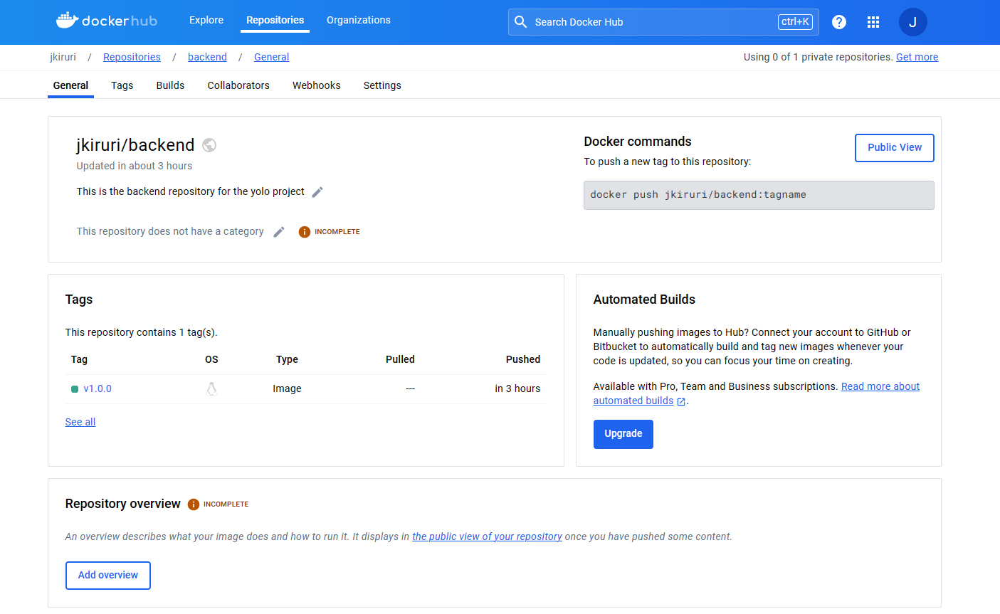

Explanation for Docker Independent Project
Objective 1: Choice of Base Image
Backend Container
For the backend container, I chose the node:alpine base image. This image provides a lightweight Node.js environment based on the Alpine Linux distribution, which helps to keep the overall image size small.

Frontend Container
Similarly, for the frontend container, I opted for the nginx:1.22-alpine base image. This image provides a minimal Nginx server setup, again based on Alpine Linux, ensuring a small image size.

Objective 2: Dockerfile Directives
Backend Container
In the Dockerfile for the backend container, I used directives like FROM, WORKDIR, COPY, RUN, and CMD. These directives are used to set up the Node.js environment, install dependencies, copy the application code, and define the command to run the Node.js application.

Frontend Container
In the Dockerfile for the frontend container, I similarly used directives like FROM, WORKDIR, COPY, and CMD to set up the Nginx server environment, copy the built frontend code, and define the command to start the Nginx server.

Objective 3: Docker-compose Networking
I implemented a custom bridge network named ecommerce-network in the docker-compose.yml file. This network allows seamless communication between the backend, frontend, and database containers while isolating them from external networks.

Objective 4: Docker-compose Volume Definition and Usage
I defined a volume named yolo in the docker-compose.yml file under the volumes section. This volume is used to persist data for the MongoDB database container, ensuring that data remains intact even if the container is stopped or removed.

Objective 5: Git Workflow
I followed a structured Git workflow with descriptive commits, documenting each step of the project development process. The README file provides an overview of the project, including setup instructions and usage guidelines.

Objective 6: Successful Running of Applications
The applications were successfully containerized and orchestrated using Docker Compose. The backend, frontend, and database containers were all launched and connected within the custom bridge network. The application runs smoothly, allowing users to interact with the e-commerce site without any issues.

Objective 7: Docker Image Tag Naming Standards
I adhered to Docker image tag naming standards by versioning all images built during the project. Each image tag follows semantic versioning conventions to clearly indicate the version and any relevant changes. eg 

Objective 8: Image Deployment
All images built during the project were pushed to DockerHub for deployment, kindly find screenshots below.

